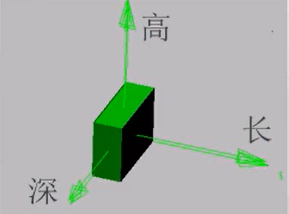
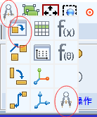
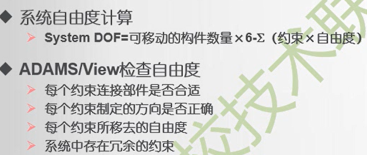

# Markdown学习笔记

## 学习情况

未入门，仅有快捷键及基本概念

## 快捷键

| 快捷鍵       | 作用                           |
| ------------ | ------------------------------ |
| T+左键       | 平动模型                       |
| R+左键       | 旋转模型                       |
| Z+左键       | 动态缩放                       |
| S+左键       | 沿着垂直于屏幕的轴线旋转       |
| W+左键       | 将屏幕的一部分放大             |
| E+左键       | 将某构件的XY平面作为观察面     |
| Shift+S      | 实体化显示                     |
| F或Ctrl+F    | 以最大比例全面显示模型         |
| C+左键       | 定制旋转中心                   |
| G            | 切换工作格栅的隐藏与显示       |
| V            | 切换图标的隐藏与显示           |
| M            | 打开信息窗口                   |
| Esc          | 结束当前得操作                 |
| Ctrl+N       | 新建数据库                     |
| Ctrl+O       | 打开数据库                     |
| Ctrl+S       | 保存数据库                     |
| Ctrl+P       | 打印                           |
| Ctrl+Q       | 退出ADAMS/View                 |
| Ctrl+Z       | 取消上一步操作                 |
| Ctrl+Shift+z | 恢复上一步的撤销操作           |
| Ctrl+E       | 编辑一个元素                   |
| Ctrl+C       | 复制一个元素                   |
| Ctrl+X       | 删除一个元素                   |
| F1           | 根据当前的状态，打开相应的帮助 |
| F2           | 打开读取命令文件的对话框       |
| F3           | 打开命令输入窗口               |
| F4           | 打开坐标窗口                   |
| F8           | 进入后处理模块                 |

cm 质心
Database Navigator数据索引
*表示所有文件
d*可搜索d开头文件

## 基本概念
### 1.几何点point（没有id）
是创建几何体或铰链的基础
创建几何体时，选择已经存在的点，修改点的坐标，与点关联的几何体也会移动
add to ground /add to part
创建时，先选择添加到几何体或者地，再选择添加位置（与“add”区别？）
### 2.坐标系marker（有id）
### 3.多义线Polyline
没有体积，没有质量信息（会报错）
右键结束
选择closed会自动封闭
多义线可pick曲线或圆弧，多义线将会沿曲线（但实际并非真正的弧线，为多个短直线）
### 4.圆弧Arc
圆弧实际上是多义线构成的
segement count即为分段数
angle有d为角度制，没有则为弧度制
创建时，会同时生成一个坐标，angle即为相对于坐标的角度
### 5.样条Spline
封闭至少需要8个点
非封闭至少需要4个点
满足条件，线条颜色有蓝变红
再点相同点可取消
### 6.集中质量点（质点）
无几何形状、惯性特性、角速度
### 8.立方体box

创建时，会自动生成一个局部坐标系，用来控制立方体的移动和旋转
同时，在对角线生成一个热点，拖动调整长和高(修改深度：需将坐标系改为xz坐标系)
### 9.圆柱体cylinder
### 10.球体sphere
有三个热点
可修改旋转角度
### 11.圆锥台frustum
### 12.圆环体torus
注意大半径为到中点的距离
### 13.连杆link
起始段坐标点i_marker，j_marker，控制其长度（注意不要选到全部实体）
### 14.平板plate
radius倒圆角
### 15.拉伸体extrusion
扫描
### 16.回转体revolution
先旋转中心，后封闭图形（不封闭则无质心）
analytical由样条曲线组成
non-analytical由多义线组成
### 16.刚性面
无质量信息，可以用来定义接触，以便在两个构件接近时，使两个构件产生碰撞
### 17.布尔操作
#### 1)布尔加unite
重叠部分合为一体
#### 2)布尔和merge
两物体并为一体
#### 3)布尔减intersect
取交集或者一个物体减去交集
#### 4)布尔分split
一个物体分为两个物体
#### 5)布尔链chain
将首位相连的构造线连城一条线

### 18.从cad导入
model name（可以是新名字，也可以是已经存在的） 导入的是彼此独立的构件
part name 导入的模型成为一个单独的零件

### 19.倒角
有x符号为起始点
### 20.打孔
### 21.凸台boss
### 22.抽壳shell
### 23.编辑构件
编辑对话框
构件右键
模型树shift多选
edit--modify
edit--select list
inherit继承父项设置
编辑信息
材料
初速度
重命名：edit--rename
编辑位置：edit--move

### 24.自由度DOF

### 25.平行副
两物体的两个边平行

### 26.齿轮副

啮合点创建marker，ADAMS要根据这marker的Z方向来确定两个齿轮啮合点的速度方向。ADAMS规定，这个marker的Z方向应该指向啮合点的速度(切线)方向。我们现在来看这个marker，它实际上是一个坐标系。

